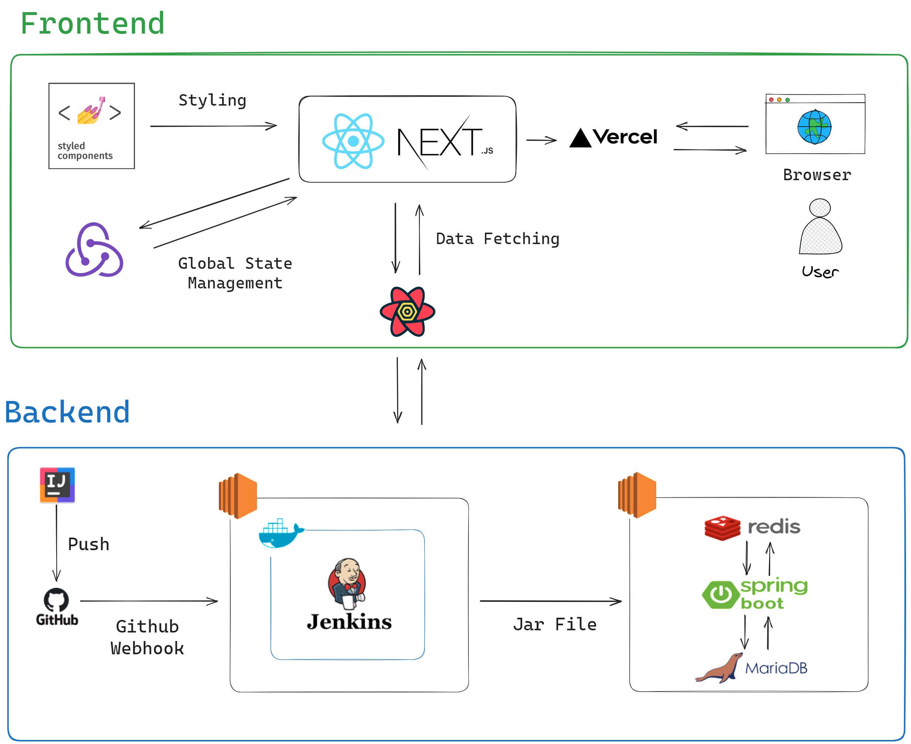
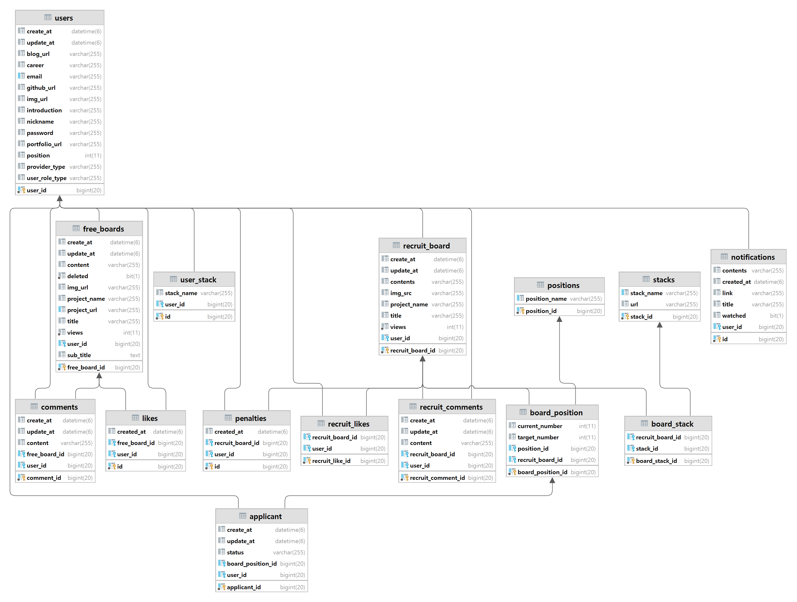

<div style="display: flex;justify-content: center"></div>

<h3>열정을 함께할 동료가 필요할 때, 사이드 이펙트</h3>
<p>개발자, 디자이너 등 누구나 쉽게 프로젝트를 시작하고, 네트워킹할 수 있는 커뮤니티 플랫폼입니다</p>

[서비스 구경하기](https://side-effect-frontend-dev.vercel.app/)

[팀 소개](https://github.com/Side-Effect-Team)

[프론트 레포](https://github.com/Side-Effect-Team/side-effect-frontend)

[API 문서](https://sideeffectproject.com/docs/swagger-ui/index.html)

<br>

## 🛠️ 기술 스택

<div>


</div>
<br>



## 🌳 폴더 구조

```
src─|
    java
    ├─common : Exception관련 파일이나 공통 클레스(aop, validation, converter, image upload) 파일로 구성
    ├─config : 각종 설정파일 구성
    ├─controller : 컨트롤러 파일 보관
    ├─domain
    │  ├─[domain name] : 각 도메인마다 엔티티파일과 연관 enum 파일로 구성
    ├─dto
    │  ├─[domain name] : 각 도메인의 dto 파일 보관
    ├─redis : redis 레파지토리 파일 보관
    ├─repository : 레파지토리 파일 보관
    ├─security : spring security 파일 구성
    ├─service : 서비스 파일 보관
    resources
    ├─mail-templates : 알림 메일 템플릿 파일 보관
    
test─|
    java
    ├─common
    │  ├─docs : Rest Docs 관련 유틸파일과 공통 클래스
    │  ├─jpa : jpa(query dsl) 테스트 관련 설정
    │  ├─securty : custom mock user 관련 파일
    ├─controller : 컨트롤러 테스트 파일 보관
    ├─convertor  : 컨버터 테스트 파일 보관
    ├─dto : dto 테스트 파일 보관
    ├─redis  : redis 레파지토리 테스트 파일 보관
    ├─repository : 레파지토리 테스트 파일 보관
    ├─security : spring security 관련 테스트 파일 보관
    ├─service : 서비스 테스트 파일 보관
```

## 💻 주요 기능

### 모집 게시판
- 사이드 프로젝트나 포트폴리오를 위한 프로젝트 팀원을 구하는 게시판 구현
- 댓글, 추천 기능 구현
- 키워드 및 기술 태그 검색 및 무한 스크롤 기능 구현
- 게시글 모집 포지션 지원 기능 구현
- 지원자 및 팀원 관리 기능 구현
- 지원 취소 기능 구현
### 자랑 게시판
- 만든 프로젝트를 자랑하는 게시판 구현
- 댓글, 추천 기능 구현
- 키워드에 따른 검색 조회 기능 구현
- 댓글수, 조회수, 최신순, 좋아요수에 따른 무한 스크롤 기능 구현
- 이미지 업로드 기능 구현
### 유저
- JWT(Access Token, Refresh Token) 구현
- Spring Security를 통한 보안 설정
- SNS 로그인 구현
- 알림 기능 구현

## 📃 ERD


## 🧑‍💻 만든 사람들

이름순

<table>
	<tbody>
		<tr>
			<th></th>
			<th></th>
			<th></th>
		</tr>		
		<tr>
			<th><a href="https://github.com/xjfcnfw3" target="_blank">김민수</a></th>
			<th><a href="https://github.com/sksrpf1126" target="_blank">임성현</a></th>
			<th><a href="https://github.com/tlsrl6427" target="_blank">홍신기</a></th>
		</tr>	
	</tbody>
</table>
